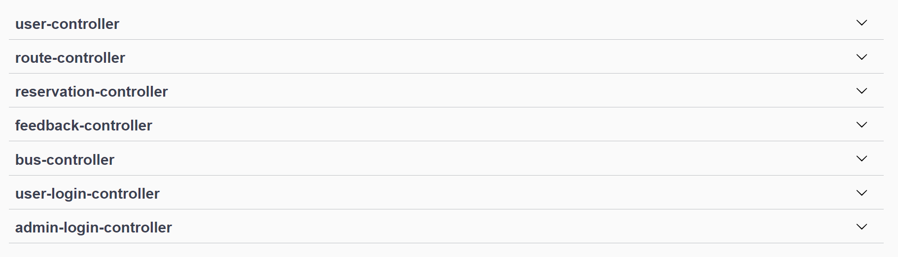
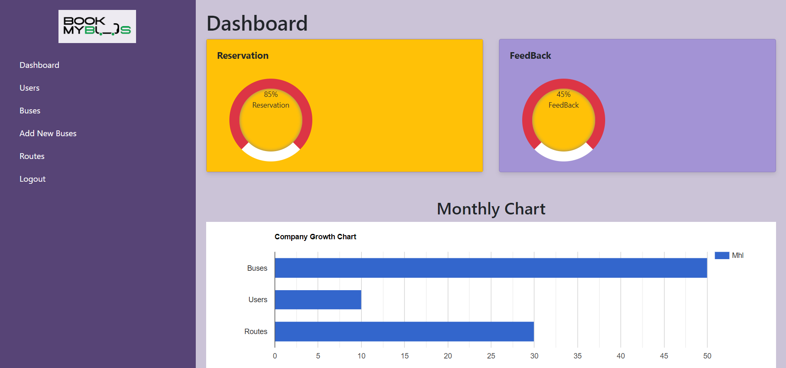
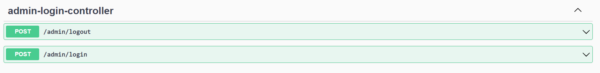
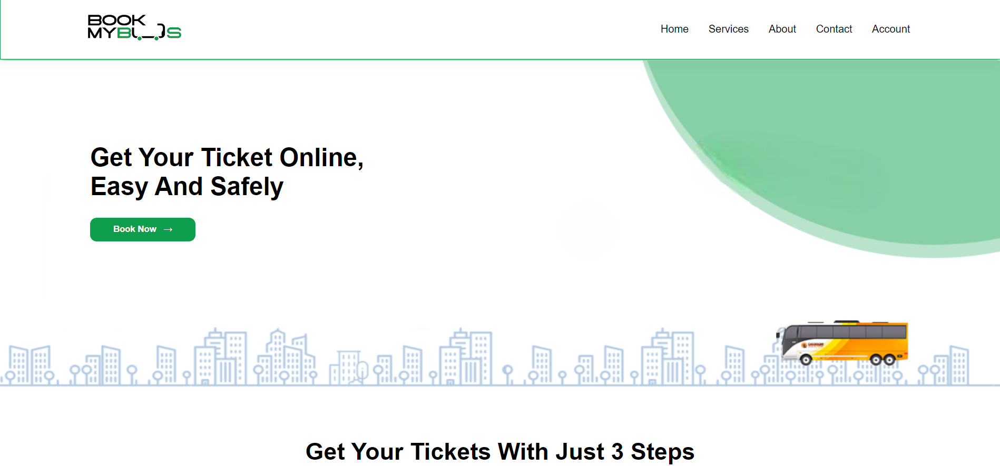
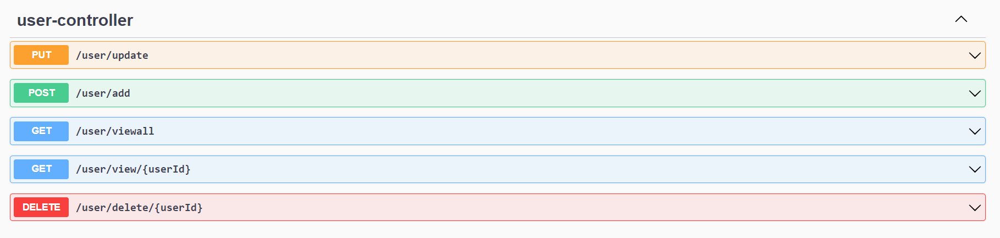

  
# Book my bus

> Book my bus (bus ticket reservation system) is an RESTful web service designed to provide customers with a personalized easy-to-utilize user experience for booking and purchasing tickets online. It stores customers' personal data records, scheduled routes, frequent trips, drop points, and other information.

> It has 6 modules Admin, User, Reservation, Bus, Route and Feedback.

> Book my bus (Bus ticket reservation system) application during the construct week at [Masai School](https://masaischool.com/). Completed the project in five days with a team of five aspiring developers.

# Features

- User and Admin authentication and validation using session uuid
- Admin can provide details like Bus Name, Bus Route, Bus Type –AC/non-AC, seats, departure time and arrival time
- Admin can provide details of route
- Admin can provide the confirmation of the seat to the User
- User can register by giving all the details
- User can book ticket by selecting Source and destination
- User can give feedback for bus experience
- User can cancel reservation

# Technology used 

- Java
- Javascript
- Spring Boot
- Spring data JPA
- HTML
- CSS
- MySQL
- RESTful api
- Hibernate
- Swagger
- Lombok
- Maven
- Postman
- Spring tool suite eclipse
- Git & GitHub

# Modules

- Login Logout Module
- Admin Module
- User Module
- Route Module
- Bus Module
- Reservation Module
- Feedback Module

# Lessons Learned

- Gain excessive knowledge on application of Java, MySQL and SpringBoot.
- Gain knowledge on creating RESTful API.
- Got to know how to collabrate with team members.
- Enjoyed the process of learning and creating the application.

# Overview of Our work

## **Er Diagram** 
*Er diagram of our project*
 

## **All Modules** 
*All modules of our project*
 

## **Admin Home page and Module** 
*Admin can login by using username (admin) and password (admin1234)*
### Admin Home page

 
### Admin Module

 

## **User landing page**

## **User Module**
*Customer can signup first if not registered earlier*
 

*Customer can login with earlier provided username and password*
 

## **Bus Module** 
*Admin can add Bus by providing neccessary details*
 

## **Route Module**
*Admin can add Route by providing neccessary details*
 

## **Reservation Module**
*User can book Reservation by selecting Source and destination*
 

## **Feedback Module**
*User can give feedback for bus experience*
 

# Contributor

#### Deependra yadav
> Github: [DeependrYadav](https://github.com/DeependrYadav) 
(Teamlead)
Worked on Backend

#### Shivam kumar Jha
> Github: [Shivam6209](https://github.com/Shivam6209)
Worked on Login and SignUp page

#### Ramanjeet Singh
> Github: [gzbsingh](https://github.com/gzbsingh)
Worked on Admin panel

#### N MOHAMMED NAWAZ
> Github: [nmohammednawaz](https://github.com/nmohammednawaz)
Worked on User side

